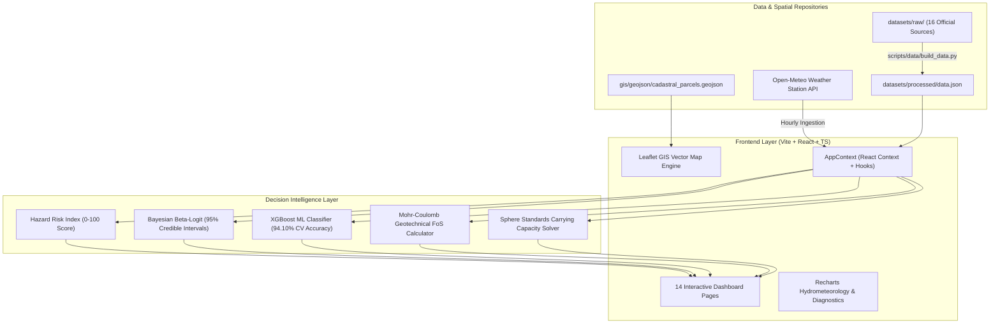

# NIVARA — System Architecture & Multi-Tiered Design

NIVARA is an enterprise-grade Decision Support Platform built for the **Kerala State Disaster Management Authority (KSDMA)** and National Disaster Response agencies to automate cadastral red-zone demarcation, Bayesian hazard probability updating, and carrying-capacity-constrained relocation allocation.

---

## 🏛️ High-Level System Architecture Diagram



---

## 📁 Repository Directory Structure

```text
NIVRA/
├── frontend/             # User Interface (React, TypeScript, Tailwind, Vite, Leaflet)
├── backend/              # Server-Side APIs, Microservices & Routing
├── ml/                   # Machine Learning Models (XGBoost 3.4.1, Bayesian Inference)
├── datasets/             # Ingestion Tables, Rainfall, Population, Soil, Elevation
├── gis/                  # Boundaries, Shapefiles, Cadastral GeoJSON Layers
├── scripts/              # Data Pipeline & Automation Utilities
├── docs/                 # Engineering Specifications & Mathematical Proofs
├── tests/                # Test Suites for Frontend, Backend & ML
├── .env.example          # Environment Variable Configuration Template
├── .gitignore            # Git Ignore Rules
└── README.md             # Master Project Overview
```
